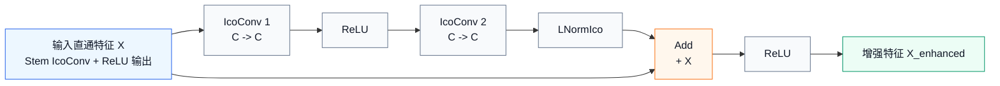

# DFA-IcoNet-Edge 网络整体框架流程图

> 用途：作为中期答辩 PPT 的网络结构图草稿。  
> 主图对应当前完整链路：`PHAT + LMS` 双特征输入、双分支残差增强、共享注意力融合、Edge 轻量化主干、可选 `pre_readout MABA`、DOA 读出。

## Mermaid 流程图

```mermaid
flowchart LR
    A["多通道麦克风音频"] --> B["双特征前端"]
    B --> C1["SRP-PHAT<br/>二十面体特征图"]
    B --> C2["SRP-LMS<br/>二十面体特征图"]

    subgraph S1["PHAT 分支"]
        C1 --> P0["Stem IcoConv<br/>1 -> C"]
        P0 --> P1["直通特征"]
        P0 --> P2["Residual Learning<br/>增强特征"]
        P2 --> P3["Shared Attention<br/>学习 PHAT 权重"]
        P1 --> P4["Branch-local Fusion<br/>direct + weight * enhanced"]
        P3 --> P4
        P2 --> P4
    end

    subgraph S2["LMS 分支"]
        C2 --> L0["Stem IcoConv<br/>1 -> C"]
        L0 --> L1["直通特征"]
        L0 --> L2["Residual Learning<br/>增强特征"]
        L2 --> L3["Shared Attention<br/>学习 LMS 权重"]
        L1 --> L4["Branch-local Fusion<br/>direct + weight * enhanced"]
        L3 --> L4
        L2 --> L4
    end

    P4 --> F0["Second-stage Fusion<br/>PHAT fused + LMS fused"]
    L4 --> F0
    F0 --> F1["PoolIco<br/>r = 2 -> r = 1"]

    subgraph S3["轻量化二十面体主干"]
        F1 --> H1["4 x FusionTemporalBlock<br/>IcoConv + ReLU + causal Conv1d + LNorm"]
        H1 --> H2["FinalFusionBlock<br/>IcoConv + ReLU + causal Conv1d + LNorm"]
    end

    H2 --> M0{"是否启用<br/>pre_readout MABA"}
    M0 -- "DFA-IcoNet-Edge" --> R0["Channel Readout<br/>C -> 1"]
    M0 -- "DFA-IcoNet-Edge-MABA" --> M1["Feature MABA Refiner<br/>Temporal Conv + Gate + State Scan + Residual"]
    M1 --> R0

    R0 --> R1["Region Max<br/>R = 6 -> 1"]
    R1 --> R2["CleanVertices"]
    R2 --> R3["SoftArgMax"]
    R3 --> O["DOA 输出<br/>(x, y, z) 或 azimuth/elevation"]

    classDef input fill:#edf7ff,stroke:#2563eb,color:#111827;
    classDef branch fill:#f8fafc,stroke:#64748b,color:#111827;
    classDef fusion fill:#fff7ed,stroke:#f97316,color:#111827;
    classDef maba fill:#ecfdf5,stroke:#059669,color:#111827;
    classDef output fill:#fef2f2,stroke:#dc2626,color:#111827;

    class A,B,C1,C2 input;
    class P0,P1,P2,P3,P4,L0,L1,L2,L3,L4 branch;
    class F0,F1,H1,H2,R0,R1 fusion;
    class M0,M1 maba;
    class R2,R3,O output;
```



## PPT 简化口径

- `DFA-IcoNet`：保留双特征、双分支、attention fusion 和深层 fusion head，主干宽度使用完整宽度配置。
- `DFA-IcoNet-Edge`：在融合后通过 `PoolIco: r=2 -> r=1` 降低后端空间计算，并将主干宽度收缩到 `C=8`。
- `DFA-IcoNet-Edge-MABA`：在 `FinalFusionBlock` 后、`Channel Readout` 前加入 `pre_readout MABA`，用于 feature 级时序重整。

## 讲解顺序

1. 先讲输入：从单一 PHAT 扩展为 `PHAT + LMS` 双特征二十面体图。
2. 再讲分支：每个特征都有直通路径和 residual-enhanced 路径。
3. 再讲 attention：根据当前声学环境学习特征权重，避免固定比例融合。
4. 再讲 Edge：融合后降分辨率、降通道宽度，让 IcoConv 主瓶颈更适合硬件映射。
5. 最后讲 MABA：它不是替代原有 1D 卷积，而是在读出前补充 feature 级时序重整。

## Residual Learning Module 结构（当前主线）

当前每个前端分支都有一个相同结构的残差增强模块，输入是该分支经过 `Stem IcoConv + ReLU` 后的直通特征。  
注意：中期实验主线主要来自早期 residual 版本。后续曾短暂提交过更接近 IFAN 论文图的双残差注入结构，但该版本之后几乎没有形成完整实验主线，因此当前汇报按早期 residual 版本表述。



对应计算关系可以写成：

```text
X_direct = ReLU(StemIcoConv(feature))
Z = ReLU(IcoConv1(X_direct))
Z = IcoConv2(Z)
Z = LNormIco(Z)
X_enhanced = ReLU(Z + X_direct)
```

## 为什么这样做

- 保留原始定位响应：直通特征 `X_direct` 不被覆盖，PHAT/LMS 中已有的可靠峰值可以直接进入后续融合。
- 学习残差校正：两层 `IcoConv` 在二十面体邻域上重整空间响应，让模块更像学习“如何修正峰值扩散、伪峰和局部噪声”，而不是从头重建定位图。
- 归一化增强特征：`LNormIco` 在残差相加前对增强分支做归一化，降低异常峰值或尺度波动对后续 attention 的影响。
- 改善训练稳定性：末端残差相加给梯度和信息都留了短路径，避免前端分支加深后把有用的空间线索洗掉。
- 服务后续 attention：模块输出的是 `enhanced feature`，后面 attention 根据声学环境决定增强特征该占多大权重；因此残差模块和 attention 是配套的，不是单独替代原始特征。
- 对复杂声学环境更有价值：低 SNR、强混响时 PHAT/LMS 都可能出现误峰，残差增强提供了一个局部几何校正步骤，再由融合模块选择更可靠的证据。

PPT 上可以把这部分概括为一句话：  
**残差模块保留直通空间响应，同时通过二十面体卷积和 LNormIco 学习归一化后的响应校正，为后续注意力融合提供更稳定的增强特征。**

## 历史版本与消融口径

项目后期曾短暂切换到一个更接近 IFAN 论文图的 residual 版本，结构大致是：

```text
X_direct = ReLU(StemIcoConv(feature))
Z1 = ReLU(IcoConv1(X_direct))
Z2 = Z1 + X_direct
X_enhanced = IcoConv2(Z2) + X_direct
```

它和当前主线版本的主要区别：

| 对比项 | 当前主线 residual 版本 | 后期 paper-aligned residual 版本 |
| --- | --- | --- |
| 残差注入次数 | 末端 1 次 | 中间 1 次 + 末端 1 次 |
| 归一化 | residual 内部带 `LNormIco` | residual 内部不带 `LNormIco` |
| 输出激活 | 末端 `ReLU` | 末端不额外 `ReLU` |
| 实验口径 | 中期主要结果对应这一版 | 后续实验很少，不作为主线结果 |

因此答辩中更稳妥的说法是：

- 当前主线采用带 `LNormIco` 的残差增强模块，用于得到更稳定的 `enhanced feature`。
- 后期 paper-aligned residual 版本仅保留为结构对齐尝试，不作为中期主要实验口径。
- 中期汇报的创新重点仍放在 `PHAT + LMS` 双特征链路、attention fusion、Edge 轻量化和 `pre_readout MABA` 时序增强。
