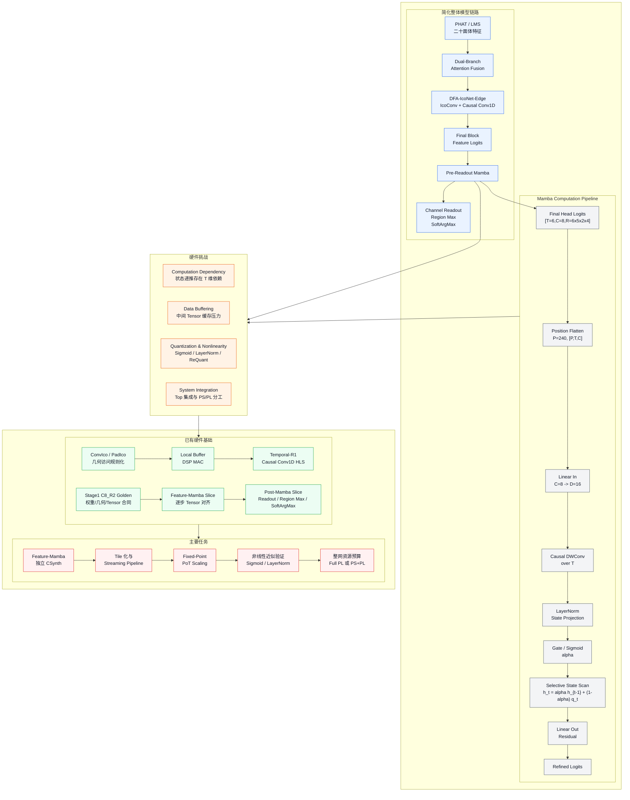

# DFA-IcoNet-Edge-Mamba 硬件落地框架图

> 用途：作为中期答辩硬件部分的一页 PPT 框架图草稿。  
> 设计口径：前面页面已经说明加入 Mamba 的算法动机，本页不再重复动机；重点展示“整体模型如何接入 Pre-Readout Mamba、Mamba 内部如何计算、硬件挑战如何落到已有基础和后续任务”。

## Mermaid 框架图



## 推荐 PPT 布局

- 第一行左侧：简化整体模型链路，从 `PHAT/LMS` 到 `Pre-Readout Mamba`，再到 `Channel Readout / Region Max / SoftArgMax`。
- 第一行右侧：保留 `Mamba Computation Pipeline`，突出 `Position Flatten -> Linear In -> Causal DWConv -> Gate / State Scan -> Linear Out`。
- 第二行中部：`Hardware Challenges`，只放四个挑战框，不再画复杂内部箭头。
- 第三行：左下 `已有硬件基础` 指向右下 `主要任务`，形成从现有 HLS 工作到后续闭合路线的收束。
- 箭头只表示模块级逻辑依赖，不表达每个算子和每个挑战的一一对应关系。

## 优化后的绘图提示词

请绘制一张硕士论文风格的研究路线框图，主题为：

```text
DFA-IcoNet-Edge-Mamba
Pre-Readout Mamba Computation and Hardware Deployment Roadmap
```

整体要求：

- 使用 IEEE Transactions 风格的高分辨率矢量框图。
- 整体布局采用三行结构：第一行左侧为简化整体模型框图，第一行右侧为 `Mamba Computation Pipeline`；第二行为 `Hardware Challenges`；第三行为 `Existing Hardware Foundation -> Remaining Tasks`。
- 不使用卡通风格，不使用复杂装饰；采用模块化矩形框、清晰标题、少量箭头。
- 大多数文字使用中文，专业神经网络和硬件术语保留英文，如 `IcoConv`、`Causal Conv1D`、`Pre-Readout Mamba`、`State Scan`、`CSynth`、`Fixed-Point`、`PoT Scaling`、`Streaming Pipeline`。

第一部分：简化整体模型框图，放在左上。标题为“简化整体模型链路”，浅蓝色区域。内容为：

```text
PHAT / LMS 二十面体特征
  -> Dual-Branch Attention Fusion
  -> DFA-IcoNet-Edge: IcoConv + Causal Conv1D
  -> Final Block Feature Logits
  -> Pre-Readout Mamba
  -> Channel Readout / Region Max / SoftArgMax
```

第二部分：`Mamba Computation Pipeline`，放在右上，浅灰色区域。保留较细的流水结构：

```text
Final Head Logits [T=6, C=8, R=6x5x2x4]
  -> Position Flatten: P=240, [P,T,C]
  -> Linear Input Projection: C=8 -> D=16
  -> Causal Depthwise Convolution over T
  -> LayerNorm + State Projection
  -> Gate / Sigmoid -> alpha
  -> Selective State Scan: h_t = alpha h_{t-1} + (1-alpha) q_t
  -> Linear Output + Residual
  -> Refined Logits
```

第三部分：`Hardware Challenges`，放在中部整行，浅橙色区域。只使用四个并列小框，不需要复杂箭头：

```text
Computation Dependency: 状态递推存在 T 维依赖
Data Buffering: 中间 Tensor 带来 BRAM/URAM 压力
Quantization & Nonlinearity: Sigmoid / LayerNorm / ReQuant 需要硬件近似
System Integration: Top 集成、PS/PL 分工和整网调度
```

第四部分：`Existing Hardware Foundation`，放在左下，浅绿色区域。内容为：

```text
ConvIco / PadIco: 几何访问规则化
Local Buffer + DSP MAC: 规则卷积映射
Temporal-R1: Causal Conv1D HLS 与 CSynth 验证
Stage1 C8_R2 Golden: 权重、几何、Tensor 合同
Feature-Mamba Slice: 逐步 Tensor 对齐验证
Post-Mamba Slice: Readout / Region Max / SoftArgMax
```

第五部分：`Remaining Tasks`，放在右下，浅红色区域。由第四部分用绿色箭头指向第五部分。内容为：

```text
Feature-Mamba 独立 CSynth，获得 DSP / BRAM / LUT / FF / Latency
Tile 化与 Streaming Pipeline，减少中间 Tensor 落地
Fixed-Point Quantization 与 PoT Scaling，降低 State Update 和 ReQuant 开销
非线性近似验证：Sigmoid / LayerNorm / SoftArgMax
整网资源预算：决定 Full PL 或 PS+PL Hybrid 部署方案
```

箭头规则：

- 蓝色箭头：整体模型链路接入 `Pre-Readout Mamba`。
- 灰色箭头：`Pre-Readout Mamba` 指向右上 `Mamba Computation Pipeline`。
- 橙色向下箭头：左上模型链路和右上 Mamba pipeline 共同指向中部 `Hardware Challenges`。
- 绿色箭头：`Existing Hardware Foundation` 指向 `Remaining Tasks`。
- 不需要给每个 challenge 单独连线，避免画面拥挤。

颜色建议：

- 简化整体模型链路：浅蓝色。
- Mamba 计算结构：浅灰色。
- 硬件挑战：浅橙色。
- 已有硬件基础：浅绿色。
- 待完成任务：浅红色。

图标题建议：

```text
Figure X. Roadmap of DFA-IcoNet-Edge-Mamba: Pre-Readout Mamba Computation and Hardware Deployment.
```

## 页面讲解口径

这页不再解释为什么引入 Mamba，而是回答三个问题：

1. `Pre-Readout Mamba` 在整网哪里接入。
2. Mamba 内部计算为什么会带来状态扫描、非线性和缓存挑战。
3. 现有 HLS 基础已经支撑了哪些部分，下一步还要完成哪些资源闭合任务。
