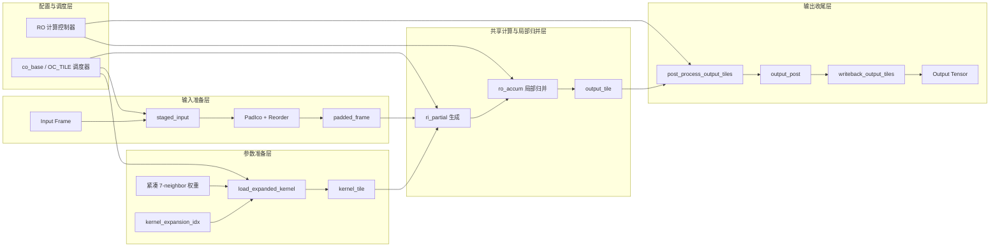
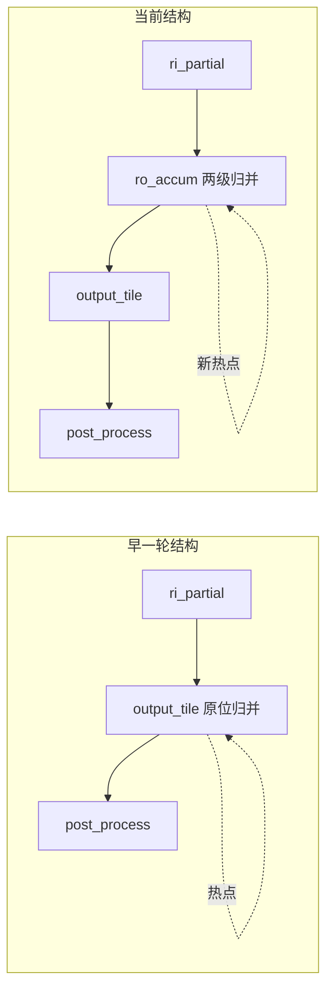
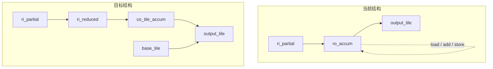
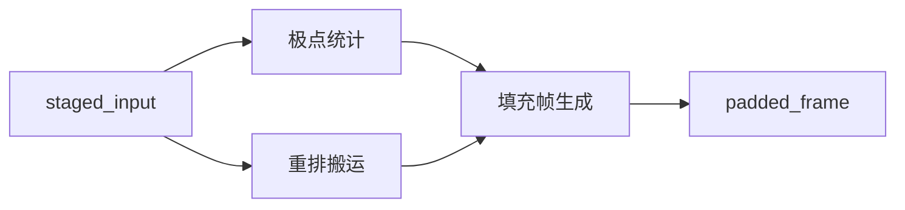

# Layer1 论文插图草图（中文）

本文档用于给 `layer1` 当前结构与下一步优化目标提供论文插图草图。  
图的目标不是精确复现代码每一行，而是把当前 `layer1` 已经完成的结构边界、已识别的瓶颈迁移、以及下一步结构优化方向，用论文可接受的方式表达出来。

建议用途：

1. 先用 Mermaid 快速验证层次与连线是否清楚。
2. 确认逻辑无误后，再转为 Visio、PowerPoint、draw.io 或 Illustrator 的正式论文图。
3. 图中颜色、线宽、阴影和图标可在正式版本中进一步美化。

---

## 图 1：Layer1 当前阶段化片上数据流结构

### 图意

这张图用于说明：  
`layer1` 已经不再是“输入直接卷积、输出直接写回”的普通 HLS 实现，而是形成了带有输入准备、局部部分和、输出收尾的阶段化片上数据流。

### 建议图注

`图 X.X  Layer1 当前阶段化片上数据流结构。`

### Mermaid 草图

### 图中模块建议说明

- `staged_input`
  - 输入局部 staging，避免 `PadIco` 直接反复访问顶层输入。
- `PadIco + Reorder`
  - 完成球面重排、极点补值与填充帧生成。
- `kernel_tile`
  - 由紧凑 7 邻域权重按需展开得到的局部 `3x3` 核缓存。
- `ri_partial`
  - 主卷积路径的局部部分和。
- `ro_accum`
  - 当前 `layer1` 的主要归并热点。
- `output_post`
  - 输出后处理与最终写回之间的显式阶段边界。

### 正式绘图建议

1. 输入准备层用蓝色系。
2. 参数准备层用灰色或青色。
3. 主计算与归并层用绿色或橙色。
4. 输出收尾层用紫色。
5. 配置与调度层放在顶部，用较浅色作为辅助控制带。

---

## 图 2：Layer1 瓶颈迁移示意图

### 图意

这张图用于说明：  
`layer1` 当前不是“没有优化成功”，而是热点已经从 `output_tile` 原位归并，迁移到了 `ro_accum` 归并环。  
主乘加路径 `ri_partial` 已经基本打通，新的问题集中在归并结构上。

### 建议图注

`图 X.X  Layer1 归并热点从 output_tile 原位归并迁移到 ro_accum 归并环。`

### Mermaid 草图

### 图边文字建议

左侧子图旁可标：

- `Final II = 4`
- `output_tile load -> add -> store`
- `carried dependence`
- `worst timing hotspot`

右侧子图旁可标：

- `ri_partial main loop: II = 1`
- `hotspot migrated to ro_accum`
- `dependence not fully removed`
- `timing improved, but merge still dominates`

### 正式绘图建议

1. 左右两张子图用统一尺寸，体现“前后对照”。
2. 热点模块外框用红色加粗。
3. 模块上的自环箭头用红色虚线，表示依赖回路。
4. 可以在左下角加一句摘要：
   `主乘加路径已打通，当前瓶颈转为归并阶段的状态保持与更新耦合。`

---

## 图 3：Layer1 下一步优化目标图

### 图意

这张图用于说明下一步不是继续“抠 pragma”，而是要做结构级重构：  
把当前 `ri_partial -> ro_accum -> output_tile` 的归并方式，改成更明确的分层归并与基值保持解耦结构。

### 建议图注

`图 X.X  Layer1 面向分层归并与基值保持解耦的下一步结构优化目标。`

### Mermaid 草图

### 图中建议强调的 3 个优化点

在目标结构右侧可加 3 条说明框：

1. `Step 1`
   - 先完成 `ri` 维局部归约
   - 生成 `ri_reduced`
2. `Step 2`
   - 再完成跨 `ci_tile` 的局部累加
   - 生成 `co_tile_accum`
3. `Step 3`
   - 基值保持与活动累加分离
   - 避免同一数组同时承担状态保持和更新

### 正式绘图建议

1. 上下对照布局比左右对照更适合表达“当前 -> 目标”。
2. `base_tile` 单独画成只读缓存，颜色用浅灰或浅蓝。
3. `ri_reduced` 和 `co_tile_accum` 可用橙色，强调“分层归并”。
4. 可以在图下加一句总述：
   `目标不是继续局部调度微调，而是将单级原位归并重构为两级局部归并与基值保持解耦结构。`

---

## 图 4：PadIco 输入准备拆分图（可选）

### 图意

如果你想进一步强调 `PadIco` 也是 `layer1` 的重要瓶颈，可以补画这张图。  
它用来说明：后续 `PadIco` 不应再被当成一个大函数，而应拆成 3 个子阶段。

### 建议图注

`图 X.X  Layer1 输入准备子系统的进一步拆分方向。`

### Mermaid 草图

### 图中建议说明

- `极点统计`
  - 专门处理 `north/south pole` 相关局部均值
- `重排搬运`
  - 专门处理 `reorder_idx` 驱动的邻接访问
- `填充帧生成`
  - 统一写入规则化 `padded_frame`

### 适合使用场景

1. 论文方法章节中想把 `PadIco` 从“大函数”提升为“输入准备子系统”时。
2. 汇报时想解释为什么 `PadIco` 会成为结构瓶颈时。

---

## 推荐最终保留的图

如果论文篇幅有限，建议至少保留：

1. 图 1：`layer1` 当前阶段化片上数据流结构
2. 图 2：热点迁移图
3. 图 3：下一步结构优化目标图

如果篇幅允许，再加：

4. 图 4：`PadIco` 输入准备拆分图

---

## 一句话总结

这组图的作用不是把代码“画出来”，而是把当前 `layer1` 的实现和瓶颈，提升为论文里的三层叙事：

1. 当前已经形成的阶段化数据流结构；
2. 当前真正的结构瓶颈发生在哪里；
3. 下一步应如何从“局部优化”走向“结构级重构”。
