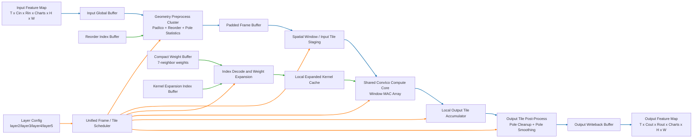
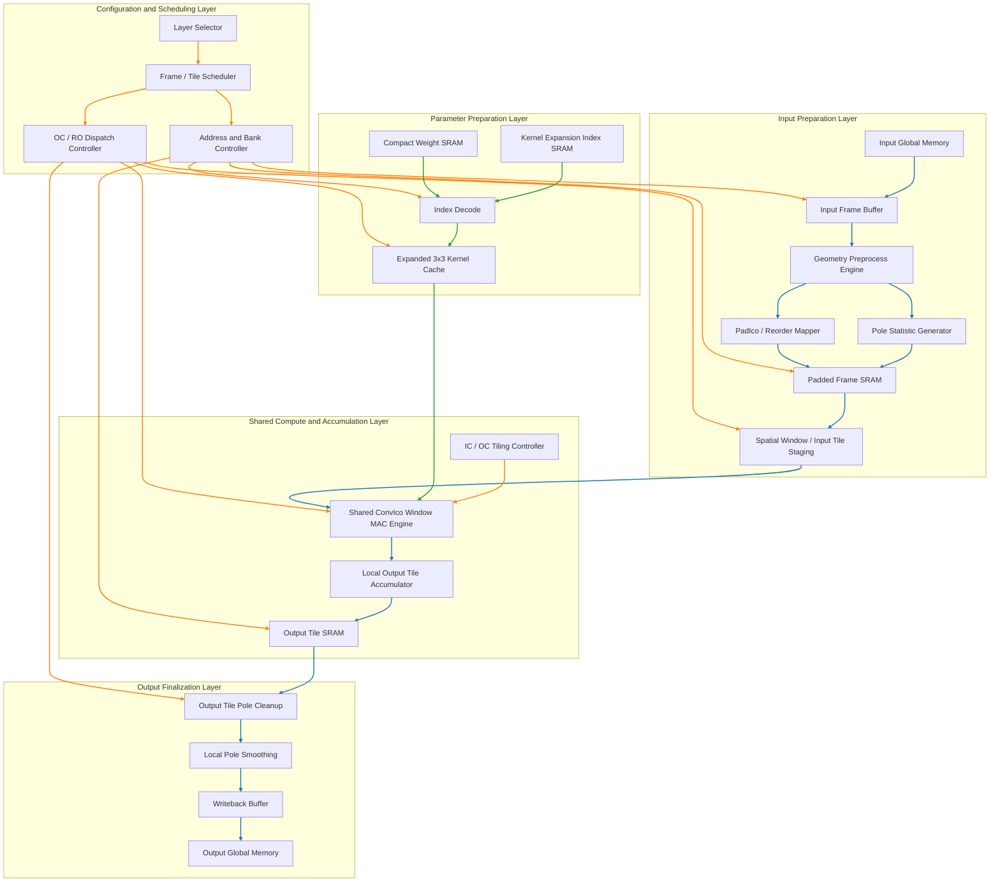
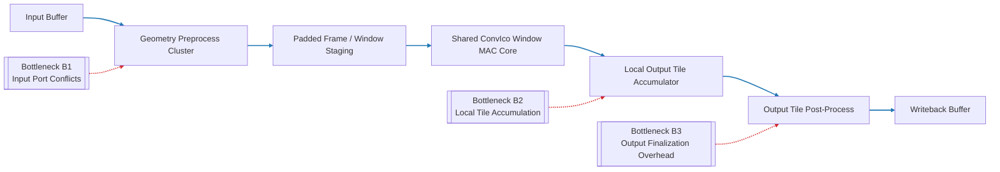

# Layer2-5 硬件优化与策略跟踪

## 0. 2026-03-22 阶段 1 稳定版更新

本次更新对应 `layer2-5` 共享 `ConvIco(r=1)` 模块的一次稳定结构重构。代码修改已经落地到
[ico_conv_layer2_5.cpp](G:/3DSLED/icocnn/hls_src/HLS/layer2-5/ico_conv_layer2_5.cpp)，
并完成了功能验证与 HLS 重新综合，可作为后续总览文档回写依据。

### 0.1 本次结构改动

1. 将主卷积从“单输出点串行 `sum += ...` 累加”改为“按 `co/ro` 组织的局部 `output_tile` 累加”。
2. 将 `kernel_expansion_idx` 驱动的 `3 x 3` 展开权重提升到 `ci/ri` 级局部 `kernel` 缓存，避免每个空间点重复展开索引。
3. 将输出极点清零与平滑从顶层 `output` 迁移到局部 `output_tile`，最后统一写回外层输出数组。
4. 对 `padded_frame` 的 `H/W` 维和 `weight` 的 7-neighbor 维加入结构化 `ARRAY_PARTITION`，为窗口读取和展开权重提供并行端口。

### 0.2 2026-03-22 功能验证结果

- 已重新编译 [test_ico_conv_layer2_5.cpp](G:/3DSLED/icocnn/hls_src/HLS/layer2-5/test_ico_conv_layer2_5.cpp) 与 [test_ico_conv_layer2_5_debug.cpp](G:/3DSLED/icocnn/hls_src/HLS/layer2-5/test_ico_conv_layer2_5_debug.cpp)。
- `layer2 / layer3 / layer4 / layer5` 四层 C 端全量回归均 `PASS`。
- 四层最大误差分别为 `7.15256e-006 / 9.05991e-006 / 5.96046e-006 / 5.72205e-006`。
- `layer2` 的 Python/C 中间层对比继续 `PASS`，输入、`PadIco`、最终输出全部保持一致。

### 0.3 HLS 综合结果对比

| 指标 | 重构前 | 2026-03-22 重构后 | 变化 |
|---|---:|---:|---:|
| Estimated Clock | `4.498 ns` | `4.472 ns` | 略优 |
| Total Latency | `6213631061 cycles` | `498988881 cycles` | `-91.97%` |
| 估算执行时间 | `31.068 sec` | `2.495 sec` | `-91.97%` |
| 单帧 iteration latency | `119492905 cycles` | `9595940 cycles` | `-91.97%` |
| BRAM_18K | `66` | `50` | `-24.24%` |
| DSP | `13` | `139` | `+126` |
| FF | `12108` | `37847` | `+25739` |
| LUT | `11337` | `32331` | `+20994` |

### 0.4 阶段结论

1. 这次收益已经证明：`layer2-5` 的主路径不能只靠 pragma 微调，真正有效的是主数据流与局部输出缓冲的结构重构。
2. 原先主 MAC 的“单点串行累加链”已被明显缓解，主计算阶段单帧 latency 从 `119439377 cycles` 降到 `9548928 cycles`，约 `12.51x` 加速。
3. 输出极点后处理不再直接对顶层 `output` 形成读写竞争，问题 C 已从“顶层输出端口冲突”转移为“局部缓冲内部的后处理调度”。
4. 当前版本已经可以视作 `layer2-5` 的“阶段 1 稳定结构版”，满足回写统一分析文档的条件。

### 0.5 当前剩余瓶颈

1. `pad_ico_Pipeline_VITIS_LOOP_76_2` 仍为 `Final II = 27`，输入端口冲突尚未解决。
2. 主空间累加循环 `VITIS_LOOP_222_8` 在 scheduling 日志中仍出现 `output_tile` 的 carried dependence，说明虽然原始 `sum` 累加链已消失，但局部 tile 累加仍有进一步优化空间。
3. 从当前 `csynth` 结果看，主计算阶段依然占据绝大多数帧内 latency，因此下一轮仍应继续围绕局部累加组织和输入访存组织推进，而不是回退到泛化 pragma 扫描。

### 0.6 下一轮动作

1. 针对 `output_tile` 局部累加关系继续压缩主空间循环的启动间隔，优先考虑更细粒度的 partial sum 分裂或空间分块。
2. 针对 `PadIco` 引入输入局部缓冲或 `ri` 维分块，专门消解 `input_r_load_* due to limited memory ports`。
3. 在保持当前稳定版可随时回归的前提下，再决定是否引入更激进的 `unroll` / `dataflow` 组合。

## 1. 文档定位

本文档用于专门跟踪 `layer2-5` 共享参数化卷积块的硬件优化过程。

它与 [分层计算访存与Latency瓶颈统一分析.md](G:/3DSLED/icocnn/hls_src/分层计算访存与Latency瓶颈统一分析.md) 的关系如下：

1. 统一分析文档负责给出全局总览、跨层比较和论文级总结。
2. 本文档负责记录 `layer2-5` 当前问题、优化假设、实验过程、结果变化和下一步动作。
3. 当本阶段形成稳定结论后，再将阶段性结果回写到统一分析文档中。

因此，本文件应被视为 `layer2-5` 的“工作台账”和“策略演进记录”。

---

## 2. 当前对象说明

当前优化对象为共享 `ConvIco(r=1)` 验证块，对应：

- 顶层函数：[ico_conv_layer2_5.cpp](G:/3DSLED/icocnn/hls_src/HLS/layer2-5/ico_conv_layer2_5.cpp)
- 头文件配置：[ico_conv_layer2_5.hpp](G:/3DSLED/icocnn/hls_src/HLS/layer2-5/ico_conv_layer2_5.hpp)
- C 验证入口：[test_ico_conv_layer2_5.cpp](G:/3DSLED/icocnn/hls_src/HLS/layer2-5/test_ico_conv_layer2_5.cpp)
- C debug 入口：[test_ico_conv_layer2_5_debug.cpp](G:/3DSLED/icocnn/hls_src/HLS/layer2-5/test_ico_conv_layer2_5_debug.cpp)

当前固定形状：

- `T = 52`
- `Cin = Cout = 32`
- `Rin = Rout = 6`
- `Charts = 5`
- `H = 2`
- `W = 4`
- `H_PADDED = 4`
- `W_PADDED = 6`

该块用于统一覆盖 `layer2`、`layer3`、`layer4`、`layer5`。

---

## 3. 当前验证状态

### 3.1 功能正确性

当前 `layer2-5` 已完成：

1. Python testdata 生成
2. Python 中间层导出
3. C 端完整输出验证
4. Python/C 中间层对比
5. HLS quick 综合与报告解析

结论：

`当前共享块功能正确，Python/C 一致性通过，可进入硬件架构优化阶段。`

### 3.2 当前 HLS 摘要

参考：

- [layer2_5_latest_summary.md](G:/3DSLED/icocnn/hls_src/hls_reports/layer2_5_latest_summary.md)
- [conv_ico_layer2_5_csynth.rpt](G:/3DSLED/icocnn/hls_src/HLS/layer2-5/layer2_5_hls_prj/sol1/syn/report/conv_ico_layer2_5_csynth.rpt)

当前关键指标：

- Target Clock: `5.00 ns`
- Estimated Clock: `4.472 ns`
- Total Latency: `498988881 cycles`
- 约合执行时间: `2.495 sec`
- BRAM_18K: `50`
- DSP: `139`
- FF: `37847`
- LUT: `32331`

当前结论：

1. 时钟仍满足要求，问题依然不在频率。
2. `layer2-5` 已经完成一轮稳定结构重构，总 latency 较 baseline 显著下降。
3. 当前剩余矛盾已从“单点串行 `sum += ...` + 全局输出端口冲突”，收敛为“`PadIco` 输入端口冲突 + 局部 `output_tile` 累加调度”。

---

## 4. 当前问题拆分

基于当前稳定版综合结果，`layer2-5` 的剩余问题可以拆成三类。

### 4.1 问题 A：局部 `output_tile` 累加相关

对应代码位置：

- [ico_conv_layer2_5.cpp](G:/3DSLED/icocnn/hls_src/HLS/layer2-5/ico_conv_layer2_5.cpp)

核心区段：

- 局部输出 tile 累加 `output_tile[ro][c][h][w] += conv`，约在 `215-240` 行附近

HLS 现象：

1. 主计算阶段仍是帧内 latency 的主要来源
2. `VITIS_LOOP_222_8` 仍对应当前局部热点
3. 局部 tile 累加仍存在 carried dependence 约束

问题本质：

虽然原始“单输出点串行 `sum += ...`”已经被移除，但当前仍是在局部 `output_tile` 上反复执行读-改-写累加，因此局部 tile 累加链仍限制启动间隔。

硬件含义：

即使总体结构已经显著优化，主计算核的局部累加组织仍是下一轮继续压缩 latency 的关键点。

### 4.2 问题 B：PadIco 输入端口冲突

对应代码位置：

- `pad_ico()` 中对 `input` 的多点读取

核心区段：

- 约在 `80-120` 行附近

HLS 现象：

1. 多条 `input_r_load_* due to limited memory ports`
2. `pad_ico_Pipeline_VITIS_LOOP_76_2`
3. `Final II = 27`

问题本质：

`PadIco` 在一个流水片段中需要访问多个输入位置，但当前数组布局和端口组织无法提供足够并行读端口。

硬件含义：

Padding/重排阶段本身就被存储访问拖慢，尚未形成高吞吐前处理结构。

### 4.3 问题 C：局部输出 tile 后处理与写回路径

对应代码位置：

- 局部 tile 极点修正与最终写回逻辑

核心区段：

- 约在 `246-284` 行附近

HLS 现象：

1. 输出后处理已经从全局 `output` 解耦到局部 `output_tile`
2. 但 tile 内极点修正与最终写回仍构成独立阶段开销
3. 输出路径已不再是旧版本那种主导性全局端口冲突

问题本质：

当前问题不再是“全局输出数组读写打架”，而是局部 tile 后处理、最终写回与主计算阶段之间还没有完全形成更激进的数据流重叠。

硬件含义：

这是稳定版之后的次级优化方向，适合在主计算与输入访存进一步压缩后继续完善。

---

## 5. 当前问题优先级

建议优先级如下：

1. 局部 `output_tile` 累加相关
原因：
这是当前稳定版中仍然主导计算路径的结构热点，也是继续降低总 latency 的最直接抓手。

2. PadIco 输入端口冲突
原因：
它仍然保持 `Final II = 27`，说明输入侧几何预处理并未跟上主干计算的结构优化速度。

3. 局部输出 tile 后处理与写回路径
原因：
它已经不再是旧版本中的主瓶颈，但作为最终成果的一部分，仍值得在后续完善为更清晰的独立数据流阶段。

---

## 6. 候选解决方案清单

本节只列“可尝试方案”，不代表全部都做，也不代表一开始就全部引入。

### 6.1 面向问题 A：局部 `output_tile` 累加相关

候选方案 A1：局部部分和银行化

思路：

1. 将 `output_tile` 沿 `ro`、空间点或局部 bank 进一步拆分
2. 降低单 bank 上的读-改-写压力
3. 最后再统一归并

预期效果：

继续压低局部 tile 累加链带来的 carried dependence

风险：

1. 局部 SRAM / 寄存器资源增加
2. bank 合并阶段会引入额外归约开销

候选方案 A2：按 `ri` 或空间点方向分阶段归约

思路：

1. 先形成更短的局部累加片段
2. 再在 tile 内执行阶段化归并

预期效果：

缩短单条局部累加依赖链长度

候选方案 A3：配合 `output_tile` 定向 partition

思路：

1. 针对局部热点维度做更有针对性的 `ARRAY_PARTITION`
2. 与局部累加银行化配合使用

预期效果：

在可控资源增长下提升局部 tile 累加并行度

注意：

不建议一开始就激进完全展开，避免资源过快失控。

### 6.2 面向问题 B：PadIco 输入端口冲突

候选方案 B1：输入局部缓存

思路：

1. 先将当前需要使用的一小块输入搬运到局部 buffer
2. 后续重排访问主要在局部 buffer 中进行

预期效果：

减少对大数组 `input` 的随机多端口访问

候选方案 B2：数组 partition

思路：

1. 对 `input` 的某些维度做 `ARRAY_PARTITION`
2. 优先考虑 `ri` 维或局部访问热点维度

预期效果：

提升可并行读取端口数

风险：

可能增加 BRAM 或寄存器开销。

候选方案 B3：PadIco 分阶段化

思路：

1. 将极点计算
2. 重排映射
3. 极点特殊位置覆盖

拆成更清晰的阶段

预期效果：

降低单一 pipeline 段内的访问复杂度

### 6.3 面向问题 C：局部输出 tile 后处理与写回路径

候选方案 C1：tile 后处理与写回阶段化

思路：

1. 先在局部 tile 内完成极点修正
2. 再进入独立 writeback 阶段
3. 避免后处理和写回混在同一逻辑层次里

预期效果：

让输出路径形成更清晰的阶段边界

候选方案 C2：输出路径 dataflow 化

思路：

1. 将局部累加、极点修正、最终写回拆成更明确的子阶段
2. 在保证正确性的前提下评估是否适合 `dataflow`
3. 让输出路径与主计算更容易重叠

预期效果：

降低输出收尾阶段的顺序执行开销

风险：

控制逻辑和中间 buffer 可能增加

候选方案 C3：极点统计单元独立化

思路：

将输出侧极点统计与最终写回单独抽象为更清晰的微架构单元。

预期效果：

更容易在论文与 HLS 实现中保持一致的结构边界

---

## 7. 研究与实验顺序

建议按以下顺序推进，每完成一步都重新验证。

### 阶段 1：共享主干结构重构

目标：

完成从“单点串行 `sum += ...` + 全局输出回改”到“局部 `output_tile` 累加 + tile 内后处理”的稳定版重构。

检查项：

1. Python/C 验证通过
2. `layer2-5` 总 latency 明显下降
3. 新结构可用于论文中的共享主干架构表述

### 阶段 2：局部 `output_tile` 累加优化

目标：

进一步压低局部 tile 累加链的依赖与阶段开销。

检查项：

1. Python/C 验证仍通过
2. 主计算热点 loop 的 interval / II 是否继续下降
3. DSP/LUT/FF 是否可接受

### 阶段 3：PadIco 输入访问优化

目标：

降低 `PadIco` 对输入数组的端口压力。

检查项：

1. `pad_ico` 相关 loop 的 `Final II` 是否下降
2. 是否引入过多 buffer 资源

### 阶段 4：输出路径阶段化完善

目标：

把局部后处理、writeback 和最终输出路径整理为更清晰的数据流结构。

检查项：

1. 局部后处理与写回阶段是否更清晰可控
2. 是否具备继续引入 dataflow 的基础

### 阶段 5：综合整理为“共享参数化架构”

目标：

把前面多轮局部优化收敛成统一架构表述，而不是零碎 patch。

---

## 8. 每次实验必须记录的内容

后续每次改动都建议按下面模板记录。

### 实验记录模板

- 日期：
- 修改目标：
- 修改文件：
- 修改内容摘要：
- 主要针对问题：
- C 端验证结果：
- Python/C 中间层对比结果：
- HLS Estimated Clock：
- HLS Total Latency：
- 关键 loop II：
- BRAM / DSP / LUT / FF：
- 结果结论：
- 是否值得保留：

---

## 9. 当前阶段性目标

本阶段不是追求“一步到位的最佳架构”，而是要先得到一版能明确说明以下问题的优化结果：

1. 为什么局部 `output_tile` 累加仍会限制吞吐
2. 为什么 `PadIco` 输入访问仍是共享主干中的主要访存热点
3. 为什么输入侧几何预处理需要继续演进成更清晰的缓冲化结构
4. 为什么输出路径需要从“功能后处理”继续演进成“结构化 tile 收尾阶段”
5. 这些问题分别适合用什么结构化方法解决

也就是说，本阶段的成果应当是：

`形成一版可以写进论文的、围绕 layer2-5 共享卷积块展开的硬件架构优化路径。`

---

## 10. 与统一分析文档的同步规则

本文件是 `layer2-5` 的动态跟踪文档。

当出现以下任一情况时，应同步更新 [分层计算访存与Latency瓶颈统一分析.md](G:/3DSLED/icocnn/hls_src/分层计算访存与Latency瓶颈统一分析.md)：

1. 形成新的稳定结构版本
2. 某类瓶颈已被明显缓解
3. 得到可作为论文结论的实验结果
4. 对 `layer2-5` 的架构理解发生了原则性变化

同步时应更新的内容包括：

1. 结构特征描述
2. latency 来源拆解
3. 关键指标表
4. 阶段性结论

---

## 11. 预期最终架构图

本节给出 `layer2-5` 共享参数化卷积块的预期最终实现形态。

该图不是当前代码逐行等价展开图，而是面向论文表达的“目标架构图”，用于说明：

1. 为什么 `layer2-5` 适合抽象成共享主干块
2. 数据在各模块间如何流动
3. 后续优化分别落在哪些结构单元上

### 11.1 学术型架构图

下面这张图给出 `layer2-5` 共享卷积块面向最终成果的总体结构。

读图建议：

1. 先只看蓝色链路。
蓝色表示主数据通路，也就是特征图从输入到输出的流动过程。

2. 再看绿色链路。
绿色表示参数与索引通路，也就是权重、索引表如何进入计算核。

3. 最后看橙色链路。
橙色表示控制通路，也就是调度器如何协调各功能模块工作。

与最初框架图相比，这一版本明确增加了两类最终会保留下来的结构边界：

1. `Kernel Expansion / Index Decode` 被细化为“索引译码与权重展开”加“本地展开 kernel 缓存”。
2. 输出端被细化为“局部 output tile 累加”与“局部 tile 内极点修正后再统一写回”，不再表现为直接对全局 `output` 的读写回改。

### 11.2 图例

为避免后续阅读混乱，可以按下面方式理解颜色：

| 颜色 | 含义 | 代表什么 |
|---|---|---|
| 蓝色 | 主数据通路 | 输入特征图、padding 后特征图、tile 数据、输出特征图 |
| 绿色 | 参数通路 | 紧凑权重、`kernel_expansion_idx`、`reorder_idx` |
| 橙色 | 控制通路 | 层选择、tile 调度、地址控制、模块启动关系 |

### 11.3 图中各模块的作用与意义

1. `Input Global Buffer`
作用：
用于承接每个时间步的输入特征图。

意义：
它是整个共享块的数据入口，决定输入数据如何被后续模块重复利用。

与其他模块的关系：
它把原始输入送给 `Geometry Preprocess Cluster`，因此是前处理链路的起点。

2. `Geometry Preprocess Cluster`
作用：
负责 `PadIco`、chart 间重排、极点统计以及几何规则化前处理。

意义：
这是共享 `ConvIco` 块区别于普通 2D CNN 的核心几何适配单元，也是当前输入端口冲突最集中的结构区域。

与其他模块的关系：
它一方面读取 `Input Global Buffer` 和 `Reorder Index Buffer`，另一方面把几何预处理后的结果写入 `Padded Frame Buffer`。

3. `Padded Frame Buffer`
作用：
保存已经完成几何重排、边界补齐和极点补值后的规则化特征图。

意义：
它把原始不规则的球面邻域访问转换成后续窗口化卷积可直接消费的规则数据布局。

与其他模块的关系：
它承接 `Geometry Preprocess Cluster` 的输出，并向 `Spatial Window / Input Tile Staging` 提供规则窗口数据源。

4. `Spatial Window / Input Tile Staging`
作用：
从 `Padded Frame Buffer` 中提取局部空间窗口，并为主计算核组织输入暂存。

意义：
它是输入侧降低访存冲突、提升局部数据复用和支撑窗口 MAC 并行化的关键模块。

与其他模块的关系：
它从 `Padded Frame Buffer` 取数，并将窗口级输入送入 `Shared ConvIco Compute Core`。

5. `Compact Weight Buffer`
作用：
保存紧凑的 7-neighbor 卷积权重。

意义：
它体现了 `ConvIco` 卷积核不同于普通 `3 x 3` 核的参数组织方式，是参数压缩表达的起点。

与其他模块的关系：
它向 `Index Decode and Weight Expansion` 提供原始紧凑权重。

6. `Kernel Expansion Index Buffer`
作用：
保存 `kernel_expansion_idx` 对应的邻域映射信息。

意义：
它决定紧凑 7-neighbor 权重如何恢复成计算核实际使用的 `3 x 3` 邻域布局。

与其他模块的关系：
它与 `Compact Weight Buffer` 一起驱动 `Index Decode and Weight Expansion`。

7. `Unified Frame / Tile Scheduler`
作用：
统一控制 layer 选择、frame 顺序、tile 顺序、OC/RO 调度以及各模块启动时序。

意义：
它决定同一套共享硬件骨架如何在 `layer2` 到 `layer5` 之间复用，也是“共享参数化”最直接的控制体现。

与其他模块的关系：
它不直接参与数值运算，但负责协调 `Geometry Preprocess Cluster`、`Spatial Window / Input Tile Staging`、`Index Decode and Weight Expansion`、`Shared ConvIco Compute Core`、`Local Output Tile Accumulator` 和 `Output Tile Post-Process` 的时序关系。

8. `Index Decode and Weight Expansion`
作用：
根据 `kernel_expansion_idx` 将紧凑权重译码并展开到当前计算阶段需要的邻域位置。

意义：
它是参数准备路径中的专用变换单元，使共享主干能够同时兼容网络原始参数组织和硬件侧规则窗口计算。

与其他模块的关系：
它接收 `Compact Weight Buffer` 与 `Kernel Expansion Index Buffer` 的输入，并将展开结果送入 `Local Expanded Kernel Cache`。

9. `Local Expanded Kernel Cache`
作用：
缓存当前 `co/ro/ci/ri` 组合对应的局部 `3 x 3` 展开 kernel。

意义：
它避免对同一空间窗口重复进行索引展开，是当前稳定版本中已经落地的重要结构单元。

与其他模块的关系：
它承接 `Index Decode and Weight Expansion` 的输出，并将本地展开后的 kernel 提供给 `Shared ConvIco Compute Core`。

10. `Shared ConvIco Compute Core`
作用：
执行基于窗口输入和本地展开 kernel 的主卷积 MAC 计算。

意义：
这是论文中最核心的共享参数化卷积主干，也是后续所有吞吐优化最主要的承载单元。

其内部目标应体现：
- `IC/OC` 方向的统一调度
- 面向局部窗口的规则 MAC
- 可在 `layer2-5` 间复用的稳定主干结构

与其他模块的关系：
它从 `Spatial Window / Input Tile Staging` 获取输入窗口，从 `Local Expanded Kernel Cache` 获取局部 kernel，并将卷积结果送入 `Local Output Tile Accumulator`。

11. `Local Output Tile Accumulator`
作用：
保存局部输出 tile 的部分和，并承担 tile 级输出累加。

意义：
它是取代“单输出点串行 `sum += ...`”的关键结构，也是当前稳定版 latency 显著下降的核心抓手之一。

与其他模块的关系：
它承接 `Shared ConvIco Compute Core` 的卷积结果，并把累加完成的局部 tile 送给 `Output Tile Post-Process`。

12. `Output Tile Post-Process`
作用：
在局部 `output tile` 内完成极点清零、极点平滑和最终几何修正。

意义：
它把原先对全局 `output` 的读写竞争，重构为 tile 内局部修正，是输出后处理解耦的关键模块。

与其他模块的关系：
它读取 `Local Output Tile Accumulator` 的结果，完成局部修正后再把最终 tile 送入 `Output Writeback Buffer`。

13. `Output Writeback Buffer`
作用：
承接最终输出 tile，并负责统一写回外层输出特征图。

意义：
它是共享块的输出落点，也是局部输出路径和全局输出数组之间的隔离层。

与其他模块的关系：
它从 `Output Tile Post-Process` 获取最终 tile，并写回 `Output Feature Map`。

### 11.4 模块之间是如何配合的

按执行顺序看，整个共享块可分成五个协同阶段：

1. 输入准备阶段
`Input Global Buffer -> Geometry Preprocess Cluster -> Padded Frame Buffer`

这一阶段的作用是把原始特征图转换成适合共享主干使用的规则化球面存储形态。

2. Tile 组织阶段
`Padded Frame Buffer -> Spatial Window / Input Tile Staging`

这一阶段的作用是从规则化特征图中提取局部窗口，为后续 MAC 核提供可重复利用的输入暂存。

3. 参数准备阶段
`Compact Weight Buffer + Kernel Expansion Index Buffer -> Index Decode and Weight Expansion -> Local Expanded Kernel Cache`

这一阶段的作用是把紧凑 7-neighbor 权重转换成当前窗口 MAC 实际使用的本地 `3 x 3` kernel。

4. 主计算阶段
`Spatial Window / Input Tile Staging + Local Expanded Kernel Cache -> Shared ConvIco Compute Core -> Local Output Tile Accumulator`

这一阶段完成共享卷积块的主体卷积运算，也是当前吞吐率最主要的承载路径。

5. 输出修正阶段
`Local Output Tile Accumulator -> Output Tile Post-Process -> Output Writeback Buffer`

这一阶段负责在局部 tile 内完成极点修正，并把结果统一写回外层输出特征图。

### 11.5 该架构图在论文中的作用

该图建议在论文中承担以下功能：

1. 作为 `layer2-5` 共享主干块的总览图。
2. 说明“网络结构特征”如何映射为“硬件功能模块”。
3. 为后文的优化章节提供结构锚点，例如：
   - 主窗口 MAC 优化对应 `Shared ConvIco Compute Core`
   - 局部累加链优化对应 `Local Output Tile Accumulator`
   - 输入端口冲突优化对应 `Geometry Preprocess Cluster + Spatial Window / Input Tile Staging`
   - 输出后处理解耦优化对应 `Output Tile Post-Process + Output Writeback Buffer`

### 11.6 该架构图对应的论文表述建议

可以配套使用如下表述：

`针对 layer2-5 在通道规模、旋转维和空间分辨率上的一致性，本文将其统一抽象为共享参数化 ConvIco 主干块。该块由几何预处理与规则化存储单元、索引译码与局部 kernel 展开单元、共享窗口 MAC 计算核心、局部输出 tile 累加单元以及 tile 内极点后处理与统一写回单元构成，从而形成一套面向该网络结构特征的数据流与存储协同硬件架构。`

### 11.7 论文插图增强版架构图

如果后续需要放进论文正文，建议优先使用下面这种已经对齐当前稳定版实现方向和后续最终成果的“分层框图”版本。

增强版中，最终会重点保留的微架构特征已经被显式画出：

1. 输入侧不再只抽象成单一 `PadIco`，而是细化为几何预处理、pole 统计、padded frame 存储和窗口级输入暂存。
2. 参数侧不再只画“权重展开”，而是细化为 `Index Decode -> Expanded 3x3 Kernel Cache -> MAC Engine`。
3. 输出侧明确采用 `Local Output Tile Accumulator -> Output Tile SRAM -> Local Pole Smoothing -> Writeback` 的闭环路径。

该版本更适合在论文中表达以下观点：

1. 该结构不是单一卷积核，而是一个由控制层、输入准备层、参数准备层、计算层和输出处理层组成的完整硬件架构。
2. `layer2-5` 的“共享参数化”本质上体现在：
   - 相同的数据通路
   - 相同的参数组织方式
   - 相同的 tile 调度方式
   - 不同层仅通过配置与权重切换实现复用

### 11.8 增强版架构图的读图方法

建议按下面顺序阅读增强版架构图：

1. 先从上到下看层次。
最上层是统一调度层，中间依次是输入准备层、参数准备层、共享计算与累加层，最后是输出最终收尾层。

2. 再看蓝色链路。
蓝色代表主数据流，表示特征图是如何在各存储和计算模块间传输的。

3. 再看绿色链路。
绿色代表参数流，表示紧凑权重如何经过索引译码与本地 kernel 展开后进入共享计算核。

4. 最后看橙色链路。
橙色代表控制流，表示统一调度器如何协调 frame、tile、bank 和输出收尾阶段。

### 11.9 当前瓶颈位置标注图

为了让后续优化章节更清晰，建议同时保留一张“当前问题在哪”的标注图。

这张图在论文里的价值是：

1. 让“瓶颈分析”可以直接映射到具体模块，而不是只停留在 HLS 报告数字。
2. 方便把后续优化章节写成：
   - 针对 B1 的输入访存优化
   - 针对 B2 的局部累加链优化
   - 针对 B3 的输出路径阶段化优化

### 11.10 图文配套建议

后续在论文中，建议这两张图配套使用：

1. 先用“增强版架构图”说明最终目标结构。
2. 再用“瓶颈位置标注图”说明当前版本的性能受限点。

这样章节逻辑会更自然：

1. 先交代架构全貌
2. 再指出瓶颈落点
3. 再逐项引出优化方法
4. 最后用实验结果证明优化有效

---

## 12. 当前版本结论

截至当前版本，可以明确认为：

1. `layer2-5` 已经是后续硬件架构优化的主战场。
2. 当前共享块已经完成一轮值得保留的稳定结构重构，功能正确且综合结果显著改善。
3. 当前版本下，`layer2-5` 的主要剩余问题已经收敛为三类：
   1. 局部 `output_tile` 累加相关
   2. `PadIco` 输入端口冲突
   3. 输出路径的阶段化完善
4. 下一步最合理的动作，是继续压缩局部 tile 累加链，并同步推进 `PadIco` 输入访存优化。
