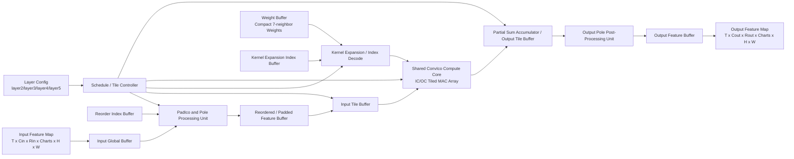
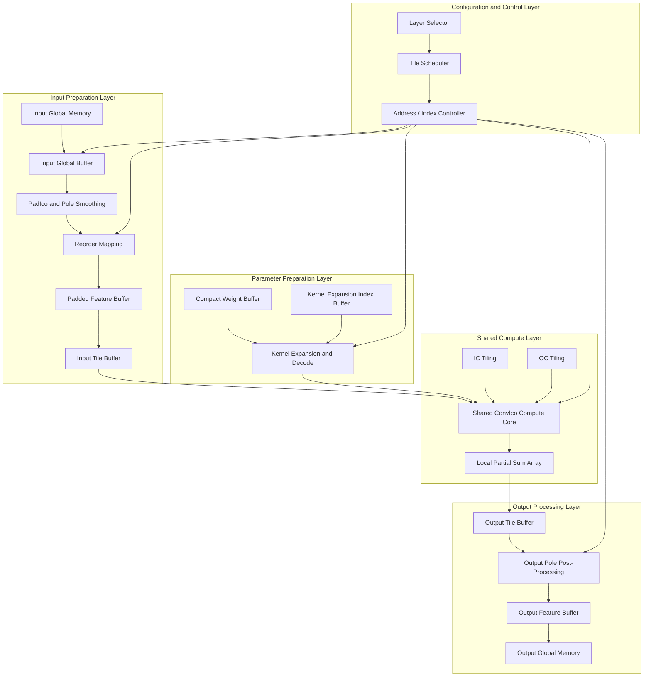
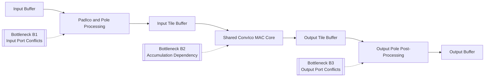

# Layer2-5 硬件优化与策略跟踪

## 1. 文档定位

本文档用于专门跟踪 `layer2-5` 共享参数化卷积块的硬件优化过程。

它与 [分层计算访存与Latency瓶颈统一分析.md](G:/3DSLED/icocnn/hls_src/分层计算访存与Latency瓶颈统一分析.md) 的关系如下：

1. 统一分析文档负责给出全局总览、跨层比较和论文级总结。
2. 本文档负责记录 `layer2-5` 当前问题、优化假设、实验过程、结果变化和下一步动作。
3. 当本阶段形成稳定结论后，再将阶段性结果回写到统一分析文档中。

因此，本文件应被视为 `layer2-5` 的“工作台账”和“策略演进记录”。

---

## 2. 当前对象说明

当前优化对象为共享 `ConvIco(r=1)` 验证块，对应：

- 顶层函数：[ico_conv_layer2_5.cpp](G:/3DSLED/icocnn/hls_src/HLS/layer2-5/ico_conv_layer2_5.cpp)
- 头文件配置：[ico_conv_layer2_5.hpp](G:/3DSLED/icocnn/hls_src/HLS/layer2-5/ico_conv_layer2_5.hpp)
- C 验证入口：[test_ico_conv_layer2_5.cpp](G:/3DSLED/icocnn/hls_src/HLS/layer2-5/test_ico_conv_layer2_5.cpp)
- C debug 入口：[test_ico_conv_layer2_5_debug.cpp](G:/3DSLED/icocnn/hls_src/HLS/layer2-5/test_ico_conv_layer2_5_debug.cpp)

当前固定形状：

- `T = 52`
- `Cin = Cout = 32`
- `Rin = Rout = 6`
- `Charts = 5`
- `H = 2`
- `W = 4`
- `H_PADDED = 4`
- `W_PADDED = 6`

该块用于统一覆盖 `layer2`、`layer3`、`layer4`、`layer5`。

---

## 3. 当前验证状态

### 3.1 功能正确性

当前 `layer2-5` 已完成：

1. Python testdata 生成
2. Python 中间层导出
3. C 端完整输出验证
4. Python/C 中间层对比
5. HLS quick 综合与报告解析

结论：

`当前共享块功能正确，Python/C 一致性通过，可进入硬件架构优化阶段。`

### 3.2 当前 HLS 摘要

参考：

- [layer2_5_latest_summary.md](G:/3DSLED/icocnn/hls_src/hls_reports/layer2_5_latest_summary.md)
- [conv_ico_layer2_5_csynth.rpt](G:/3DSLED/icocnn/hls_src/HLS/layer2-5/layer2_5_hls_prj/sol1/syn/report/conv_ico_layer2_5_csynth.rpt)

当前关键指标：

- Target Clock: `5.00 ns`
- Estimated Clock: `4.498 ns`
- Total Latency: `6213631061 cycles`
- 约合执行时间: `31.068 sec`
- BRAM_18K: `66`
- DSP: `13`
- FF: `12108`
- LUT: `11337`

当前结论：

1. 时钟满足要求，不是主要矛盾。
2. 主要矛盾是总 latency 太高。
3. 主要原因不是单一运算慢，而是循环依赖和存储端口冲突导致的 `II` 偏大。

---

## 4. 当前问题拆分

基于现有 HLS 报告，`layer2-5` 的问题可以拆成三类。

### 4.1 问题 A：主 MAC 累加相关

对应代码位置：

- [ico_conv_layer2_5.cpp](G:/3DSLED/icocnn/hls_src/HLS/layer2-5/ico_conv_layer2_5.cpp)

核心区段：

- 主卷积累加 `sum += ...`，约在 `178-190` 行附近

HLS 现象：

1. 主卷积 pipeline 存在 carried dependence
2. `Final II = 9`

问题本质：

当前输出元素的部分和 `sum` 采用串行累加，导致加法链带来 loop-carried dependence。

硬件含义：

即使时钟频率可以满足，卷积主循环也无法以低 II 发射，吞吐受限。

### 4.2 问题 B：PadIco 输入端口冲突

对应代码位置：

- `pad_ico()` 中对 `input` 的多点读取

核心区段：

- 约在 `80-120` 行附近

HLS 现象：

1. 多条 `input_r_load_* due to limited memory ports`
2. `pad_ico_Pipeline_VITIS_LOOP_76_2`
3. `Final II = 27`

问题本质：

`PadIco` 在一个流水片段中需要访问多个输入位置，但当前数组布局和端口组织无法提供足够并行读端口。

硬件含义：

Padding/重排阶段本身就被存储访问拖慢，尚未形成高吞吐前处理结构。

### 4.3 问题 C：输出端口冲突

对应代码位置：

- 输出极点平滑和回写逻辑

核心区段：

- 约在 `212-233` 行附近

HLS 现象：

1. 多条 `output_r_load_*` 和 `output_r_addr_*_write`
2. 都提示 `limited memory ports`
3. `Final II = 33`

问题本质：

同一阶段中，输出数组既被读取以计算极点平滑，又被回写修正，形成明显读写竞争。

硬件含义：

这是当前单点最重的结构瓶颈，也是下一步最值得优先改造的环节之一。

---

## 5. 当前问题优先级

建议优先级如下：

1. 主 MAC 累加相关
原因：
这是共享卷积块的核心计算环节，优化后最容易形成“通用主干架构方法”的论文表述。

2. 输出端口冲突
原因：
当前 `Final II = 33`，是最重的单点冲突之一，且结构上比较清晰。

3. PadIco 输入端口冲突
原因：
虽然也很重，但它更偏向数据重排与访存组织，适合在主卷积和输出回写结构稳定后再优化。

---

## 6. 候选解决方案清单

本节只列“可尝试方案”，不代表全部都做，也不代表一开始就全部引入。

### 6.1 面向问题 A：主 MAC 累加相关

候选方案 A1：局部部分和分解

思路：

1. 不再用单一 `sum` 串行累加所有 `ci/ri/kh/kw`
2. 将部分和拆成多个局部 `psum`
3. 最后再归约

预期效果：

降低 carried dependence，压低主卷积 loop 的 `Final II`

风险：

1. 局部寄存器或局部数组增加
2. 归约阶段可能带来新的资源开销

候选方案 A2：按 `ri` 或 `kh/kw` 方向分块归约

思路：

1. 先按某一维度形成较短的局部求和链
2. 再把多个局部和合并

预期效果：

缩短单条加法依赖链长度

候选方案 A3：配合小规模并行展开

思路：

1. 在可控维度上引入适度 unroll
2. 与局部 `psum` 组合

预期效果：

在不显著拉高资源的前提下提高并行度

注意：

不建议一开始就激进完全展开，避免资源过快失控。

### 6.2 面向问题 B：PadIco 输入端口冲突

候选方案 B1：输入局部缓存

思路：

1. 先将当前需要使用的一小块输入搬运到局部 buffer
2. 后续重排访问主要在局部 buffer 中进行

预期效果：

减少对大数组 `input` 的随机多端口访问

候选方案 B2：数组 partition

思路：

1. 对 `input` 的某些维度做 `ARRAY_PARTITION`
2. 优先考虑 `ri` 维或局部访问热点维度

预期效果：

提升可并行读取端口数

风险：

可能增加 BRAM 或寄存器开销。

候选方案 B3：PadIco 分阶段化

思路：

1. 将极点计算
2. 重排映射
3. 极点特殊位置覆盖

拆成更清晰的阶段

预期效果：

降低单一 pipeline 段内的访问复杂度

### 6.3 面向问题 C：输出端口冲突

候选方案 C1：输出后处理读写分离

思路：

1. 先只读取需要的输出极点相关值到局部变量或局部 buffer
2. 计算完平均值后，再统一回写

预期效果：

减少同一循环内对 `output_r` 的读写打架

候选方案 C2：增加中间输出缓冲

思路：

1. 主卷积先写到 `output_frame_local`
2. 后处理基于 local buffer 完成
3. 最后统一写回外层输出数组

预期效果：

明显降低 `output_r` 的端口竞争

风险：

BRAM 增加的可能性较大

候选方案 C3：极点后处理独立成单独阶段

思路：

不要把输出平滑和主输出回写强绑在同一个数据路径里。

预期效果：

更容易在 HLS 中形成清晰的数据流阶段边界

---

## 7. 研究与实验顺序

建议按以下顺序推进，每完成一步都重新验证。

### 阶段 1：主 MAC 累加链优化

目标：

先解决主计算核的串行累加依赖。

检查项：

1. Python/C 验证仍通过
2. 主卷积相关 loop 的 `Final II` 是否下降
3. DSP/LUT/FF 是否可接受

### 阶段 2：输出后处理读写解耦

目标：

降低输出极点平滑阶段对 `output_r` 的读写冲突。

检查项：

1. 输出后处理相关 loop 的 `Final II` 是否显著下降
2. BRAM 增长是否可接受

### 阶段 3：PadIco 输入访问优化

目标：

降低 `PadIco` 对输入数组的端口压力。

检查项：

1. `pad_ico` 相关 loop 的 `Final II` 是否下降
2. 是否引入过多 buffer 资源

### 阶段 4：综合整理为“共享参数化架构”

目标：

把前面多轮局部优化收敛成统一架构表述，而不是零碎 patch。

---

## 8. 每次实验必须记录的内容

后续每次改动都建议按下面模板记录。

### 实验记录模板

- 日期：
- 修改目标：
- 修改文件：
- 修改内容摘要：
- 主要针对问题：
- C 端验证结果：
- Python/C 中间层对比结果：
- HLS Estimated Clock：
- HLS Total Latency：
- 关键 loop II：
- BRAM / DSP / LUT / FF：
- 结果结论：
- 是否值得保留：

---

## 9. 当前阶段性目标

本阶段不是追求“一步到位的最佳架构”，而是要先得到一版能明确说明以下问题的优化结果：

1. 为什么主 MAC 的累加链会限制吞吐
2. 为什么输出后处理会形成严重端口冲突
3. 为什么 `PadIco` 会在共享主干块中成为访存热点
4. 这些问题分别适合用什么结构化方法解决

也就是说，本阶段的成果应当是：

`形成一版可以写进论文的、围绕 layer2-5 共享卷积块展开的硬件架构优化路径。`

---

## 10. 与统一分析文档的同步规则

本文件是 `layer2-5` 的动态跟踪文档。

当出现以下任一情况时，应同步更新 [分层计算访存与Latency瓶颈统一分析.md](G:/3DSLED/icocnn/hls_src/分层计算访存与Latency瓶颈统一分析.md)：

1. 形成新的稳定结构版本
2. 某类瓶颈已被明显缓解
3. 得到可作为论文结论的实验结果
4. 对 `layer2-5` 的架构理解发生了原则性变化

同步时应更新的内容包括：

1. 结构特征描述
2. latency 来源拆解
3. 关键指标表
4. 阶段性结论

---

## 11. 预期最终架构图

本节给出 `layer2-5` 共享参数化卷积块的预期最终实现形态。

该图不是当前代码逐行等价展开图，而是面向论文表达的“目标架构图”，用于说明：

1. 为什么 `layer2-5` 适合抽象成共享主干块
2. 数据在各模块间如何流动
3. 后续优化分别落在哪些结构单元上

### 11.1 学术型架构图

### 11.2 图中各模块的学术含义

1. `Input Global Buffer`
用于承接每个时间步的输入特征图，是共享块进入片上处理前的全局输入缓存。

2. `PadIco and Pole Processing Unit`
负责 `PadIco`、极点平滑和 chart 间重排，是该网络区别于普通 2D CNN 的关键前处理结构。

3. `Reordered / Padded Feature Buffer`
用于保存经过几何重排后的中间结果，为后续 tile 化卷积提供规则访问模式。

4. `Input Tile Buffer`
将全局 padded 特征进一步切分为适合计算核访问的局部 tile，是降低输入端口冲突的重要结构。

5. `Weight Buffer`
保存紧凑 7 邻域权重，而不是直接存完整 `3 x 3` 卷积核，从而体现该网络的参数紧凑特征。

6. `Kernel Expansion / Index Decode`
根据 `kernel_expansion_idx` 将紧凑权重映射到实际 MAC 使用的邻域位置，是当前网络特有的权重展开逻辑。

7. `Schedule / Tile Controller`
负责控制 layer 号、tile 顺序、IC/OC 分块和模块启动关系，是参数化共享架构的控制核心。

8. `Shared ConvIco Compute Core`
这是论文中最核心的共享参数化卷积核。
其内部目标应体现：
- `IC/OC tiling`
- 局部并行 MAC
- 可复用的 `layer2-5` 主干计算结构

9. `Partial Sum Accumulator / Output Tile Buffer`
用于局部部分和累加与中间输出缓存，是后续降低主 MAC 累加相关的重要抓手。

10. `Output Pole Post-Processing Unit`
负责输出端极点清零/平滑与后处理回写，是当前输出端口冲突的主要来源，也是必须独立建模的结构。

11. `Output Feature Buffer`
用于承接最终输出，再写回到外部存储或层间接口。

### 11.3 该架构图在论文中的作用

该图建议在论文中承担以下功能：

1. 作为 `layer2-5` 共享主干块的总览图。
2. 说明“网络结构特征”如何映射为“硬件功能模块”。
3. 为后文的优化章节提供结构锚点，例如：
   - 主 MAC 累加相关优化对应 `Shared ConvIco Compute Core`
   - 输入端口冲突优化对应 `PadIco + Input Tile Buffer`
   - 输出端口冲突优化对应 `Output Pole Post-Processing Unit`

### 11.4 该架构图对应的论文表述建议

可以配套使用如下表述：

`针对 layer2-5 在通道规模、旋转维和空间分辨率上的一致性，本文将其统一抽象为共享参数化 ConvIco 主干块。该块由输入重排与极点处理单元、权重展开与索引译码单元、共享 tiled MAC 计算阵列、局部部分和累加单元以及输出极点后处理单元构成，从而形成一套面向该网络结构特征的数据流与存储协同硬件架构。`

### 11.5 论文插图增强版架构图

如果后续需要放进论文正文，建议优先使用下面这种更接近“分层框图”的版本。

该版本更适合在论文中表达以下观点：

1. 该结构不是单一卷积核，而是一个由控制层、输入准备层、参数准备层、计算层和输出处理层组成的完整硬件架构。
2. `layer2-5` 的“共享参数化”本质上体现在：
   - 相同的数据通路
   - 相同的参数组织方式
   - 相同的 tile 调度方式
   - 不同层仅通过配置与权重切换实现复用

### 11.6 当前瓶颈位置标注图

为了让后续优化章节更清晰，建议同时保留一张“当前问题在哪”的标注图。

这张图在论文里的价值是：

1. 让“瓶颈分析”可以直接映射到具体模块，而不是只停留在 HLS 报告数字。
2. 方便把后续优化章节写成：
   - 针对 B1 的输入访存优化
   - 针对 B2 的累加链优化
   - 针对 B3 的输出后处理解耦优化

### 11.7 图文配套建议

后续在论文中，建议这两张图配套使用：

1. 先用“增强版架构图”说明最终目标结构。
2. 再用“瓶颈位置标注图”说明当前版本的性能受限点。

这样章节逻辑会更自然：

1. 先交代架构全貌
2. 再指出瓶颈落点
3. 再逐项引出优化方法
4. 最后用实验结果证明优化有效

---

## 12. 当前版本结论

截至当前版本，可以明确认为：

1. `layer2-5` 已经是后续硬件架构优化的主战场。
2. 当前共享块功能正确，但 latency 仍然非常高。
3. 主要问题已经比较清晰地收敛为三类：
   1. 累加相关
   2. 输入端口冲突
   3. 输出端口冲突
4. 下一步最合理的动作，是先对主 MAC 累加链做结构化改造。
