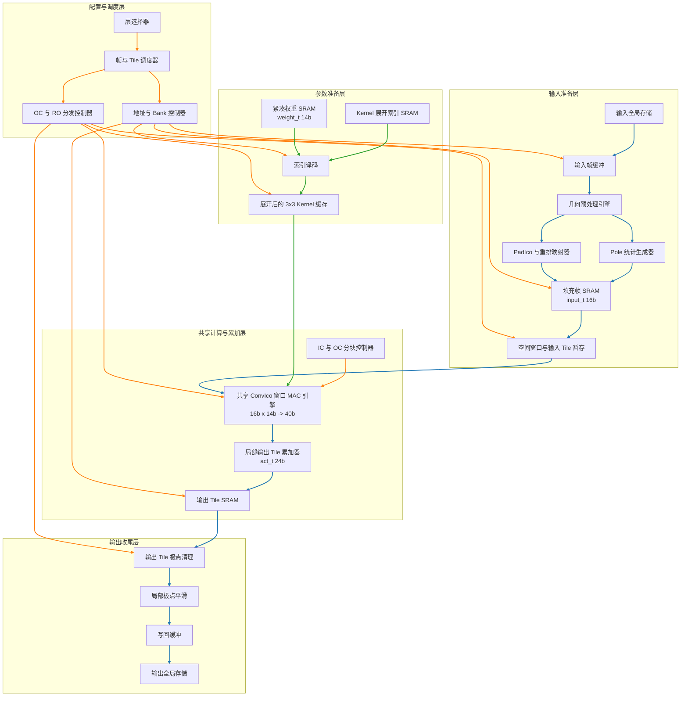

# Layer2-5 论文插图增强版架构图（中文）

以下内容从 [layer2-5硬件优化与策略跟踪.md](/g:/3DSLED/icocnn/hls_src/layer2-5硬件优化与策略跟踪.md) 的“论文插图增强版架构图”单独整理而来，保留原有层次与连线关系，仅将模块标签改为中文版本，便于直接用于论文或汇报材料。

```mermaid
flowchart TB
    subgraph S0[配置与调度层]
        C0[层选择器]
        C1[帧与 Tile 调度器]
        C2[地址与 Bank 控制器]
        C3[OC 与 RO 分发控制器]
    end

    subgraph S1[输入准备层]
        I0[输入全局存储]
        I1[输入帧缓冲]
        I2[几何预处理引擎]
        I3[PadIco 与重排映射器]
        I4[Pole 统计生成器]
        I5[填充帧 SRAM\ninput_t 16b]
        I6[空间窗口与输入 Tile 暂存]
    end

    subgraph S2[参数准备层]
        P0[紧凑权重 SRAM\nweight_t 14b]
        P1[Kernel 展开索引 SRAM]
        P2[索引译码]
        P3[展开后的 3x3 Kernel 缓存]
    end

    subgraph S3[共享计算与累加层]
        M0[共享 ConvIco 窗口 MAC 引擎\n16b x 14b -> 40b]
        M1[IC 与 OC 分块控制器]
        M2[局部输出 Tile 累加器\nact_t 24b]
        M3[输出 Tile SRAM]
    end

    subgraph S4[输出收尾层]
        O0[输出 Tile 极点清理]
        O1[局部极点平滑]
        O2[写回缓冲]
        O3[输出全局存储]
    end

    C0 --> C1
    C1 --> C2
    C1 --> C3

    C2 --> I1
    C2 --> I5
    C2 --> P2
    C2 --> M3
    C3 --> I6
    C3 --> P3
    C3 --> M0
    C3 --> O0

    I0 --> I1 --> I2
    I2 --> I3
    I2 --> I4
    I3 --> I5
    I4 --> I5
    I5 --> I6

    P0 --> P2
    P1 --> P2
    P2 --> P3

    I6 --> M0
    P3 --> M0
    M1 --> M0
    M0 --> M2 --> M3 --> O0 --> O1 --> O2 --> O3

    linkStyle 0,1,2,3,4,5,6,7,8,9,10,23 stroke:#ff7f0e,stroke-width:2px;
    linkStyle 11,12,13,14,15,16,17,21,24,25,26,27,28,29 stroke:#1f77b4,stroke-width:2px;
    linkStyle 18,19,20,22 stroke:#2ca02c,stroke-width:2px;
```
