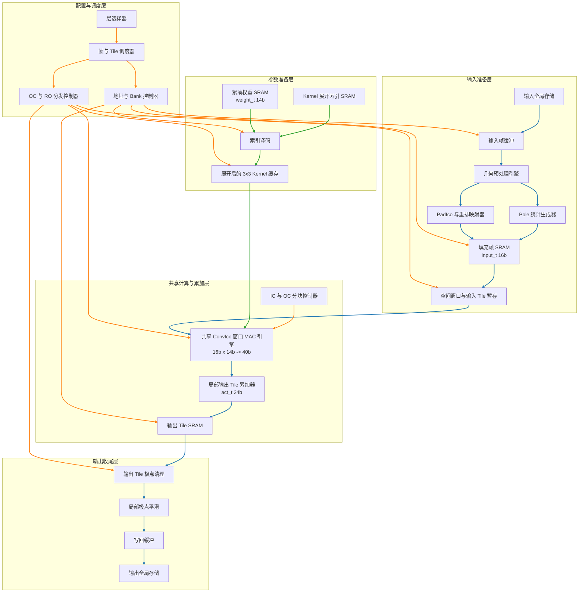

# Layer2-5 论文插图增强版架构图（中文）

以下内容从 [layer2-5硬件优化与策略跟踪.md](/g:/3DSLED/icocnn/hls_src/layer2-5硬件优化与策略跟踪.md) 的“论文插图增强版架构图”单独整理而来，保留原有层次与连线关系，仅将模块标签改为中文版本，便于直接用于论文或汇报材料。

## 图中模块与已完成改动的对应注释

这张图不是“某一次实验版本”的逐行代码展开图，而是把多轮有效改动收束后的总体架构图。因此，图中的每一层、每一个模块，往往对应一条连续的优化主线，而不是只对应某一条孤立 patch。

可以按下面方式理解“图中模块”和“实际改动”的对应关系。

### S0 配置与调度层：对应 A/B/C/D 中的流程收束与分块调度

- `层选择器`
对应共享 `layer2-5` 参数化实现的总体设计思想，即同一套硬件骨架覆盖 `layer2` 到 `layer5`，不同层通过配置切换实现复用。

- `帧与 Tile 调度器`
主要对应 `2026-03-24 A/B/C/D` 中的 `D` 类改动，也就是顶层流程被整理为  
`stage_input -> pad_ico_quantized -> init_output_tiles -> main_conv/partial_sum -> post_process -> writeback`。  
这一步不是在发明新的计算，而是在把前面已经验证有效的输入、计算、输出阶段，收束成一条可调度的固定流水。

- `地址与 Bank 控制器`
主要对应 `2026-03-22` 阶段对 `padded_frame`、`weight` 等关键数组执行 `ARRAY_PARTITION` 的改动，以及 `2026-03-24 A/B/C/D` 中对 `staged_input`、`output_tile`、`ri_partial`、`output_post` 的局部 bank 化。  
它反映的是“访存组织和 bank 分配”这条优化主线。

- `OC 与 RO 分发控制器`
主要对应 `2026-03-24 A/B/C/D` 中 `B` 类改动：引入 `co_base` 和 `OC_TILE=2` 的显式调度骨架。  
这表示输出通道和旋转维不再只是循环变量，而是被上升为架构级调度对象。

### S1 输入准备层：对应输入访存优化与 PadIco 重构

- `输入全局存储`
对应最原始的顶层输入来源。它本身不是改动点，但很多后续优化，都是为了解决“不要再让后续模块直接反复访问这个大数组”。

- `输入帧缓冲`
主要对应 `2026-03-24 A/B/C/D` 中 `A` 类改动里的 `staged_input`。  
这一步把输入先搬到局部缓冲，再进入后续预处理链路，是“输入侧 staging”设计的起点。

- `几何预处理引擎`
对应 `pad_ico()` / `pad_ico_quantized()` 所代表的整块输入几何规则化逻辑。  
从问题分析角度，它就是历史上 `input_r_load_* due to limited memory ports`、`Final II = 27` 等现象的主要承载位置。

- `PadIco 与重排映射器`
这一模块最直接对应两条改动主线：
1. 早期版本中的 `PadIco` 与 `reorder_idx` 驱动的重排映射逻辑；
2. `2026-03-24 A/B/C/D` 中 `A` 类改动：`PadIco` 不再直接从顶层 `input` 大数组取数，而是改为从局部 `staged_input` / `frame buffer` 驱动。  
也就是说，这个模块不是“后来新增”的，而是原本就有；真正的改动是它的输入供给方式和访存组织被重构了。

- `Pole 统计生成器`
这一模块主要对应 `PadIco` 内部针对极点的统计与补值逻辑，包括：
1. `north_vertex` / `south_vertex` 的局部统计；
2. `smooth_north_pole` / `smooth_south_pole` 的极点平滑统计；
3. 后续把统计结果写回 `padded_frame` 的特殊位置。  
从改动归属上看，它主要属于输入准备层内部被显式抽象出来的子单元，对应的是“原来混在 `PadIco` 里的极点统计逻辑，现在在架构图中被单独画出来”。  
因此它不是某一次单独新增的 patch，而是随着 `PadIco` 结构被论文化表达后，被明确拆分出来的关键子功能。

- `填充帧 SRAM`
主要对应两类改动：
1. `2026-03-22` 中对 `padded_frame` 的结构化分区；
2. `2026-03-24 A/B/C/D` 中 `pad_ico_quantized` 之后形成的局部规则化输入缓存。  
它的作用是把原始不规则球面邻域访问，转化为后续窗口 MAC 能稳定读取的规则局部存储。

- `空间窗口与输入 Tile 暂存`
对应输入准备层后半段的窗口组织与局部 staging。  
从代码演进上看，它主要承接：
1. `2026-03-22` 对 `padded_frame` 并行读取能力的增强；
2. `2026-03-24 A/B/C/D` 中输入 staging 设计的进一步明确化。  
它体现的是“让后面的 MAC 不再临时拼输入，而是从已经整理好的窗口缓冲读取”。

### S2 参数准备层：对应权重展开与定点量化设计

- `紧凑权重 SRAM`
对应原始 `7-neighbor` 权重存储，以及 `2026-03-24` 量化版中 `weight_t = ap_fixed<14,3>` 的收敛结果。  
因此这个模块同时承载两条主线：参数组织压缩、权重量化收敛。

- `Kernel 展开索引 SRAM`
对应 `kernel_expansion_idx`。  
它不是新增模块，但在架构图中被单独画出来，是为了说明“紧凑权重如何恢复成 MAC 真正需要的 `3x3` 邻域布局”。

- `索引译码`
对应 `expanded_weight_at()` 与 `load_expanded_kernel()` 这条权重展开路径。  
从改动角度看，它主要对应 `2026-03-22` 的“将展开权重提升到局部 kernel 缓存”这一步。

- `展开后的 3x3 Kernel 缓存`
这是参数准备层中最明确的结构性改动之一。  
它直接对应 `2026-03-22` 中“将 `kernel_expansion_idx` 驱动的 `3x3` 展开权重提升到 `ci/ri` 级局部 kernel 缓存”的设计。  
后续 `2026-03-24 A/B/C/D` 中它继续与 `OC_TILE` 调度结合，作为 MAC 核的稳定供给端。

### S3 共享计算与累加层：对应主计算重构与局部部分和组织

- `共享 ConvIco 窗口 MAC 引擎`
对应主卷积计算核心。  
它承接：
1. `2026-03-22` 对主卷积数据流的结构重构；
2. `2026-03-24` 量化版中输入/权重/累加位宽的收敛；
3. `2026-03-24 A/B/C/D` 中与 `OC_TILE`、`ri_partial` 协同的新版主计算骨架。

- `IC 与 OC 分块控制器`
主要对应 `2026-03-24 A/B/C/D` 中 `B` 类改动：`co_base`、`OC_TILE=2` 和显式 tile 调度。  
它表达的是“输出通道分块和输入通道累加不再是隐含循环，而是明确的结构调度策略”。

- `局部输出 Tile 累加器`
这一模块主要承接两步连续改动：
1. `2026-03-22`：从单点串行 `sum += ...` 改为局部 `output_tile` 累加；
2. `2026-03-24 A/B/C/D`：继续引入 `ri_partial`，先做 `ri` 级 partial sum，再归并到 `output_tile`。  
因此它是“问题 A：局部累加链优化”的核心落点。

- `输出 Tile SRAM`
对应 `output_tile` 以及后续 `output_post` 这类局部输出缓冲。  
它的架构意义是：把原本会直接回改全局 `output` 的结果，收束在局部 tile 存储中，再交给输出收尾层处理。

### S4 输出收尾层：对应输出后处理解耦与阶段化

- `输出 Tile 极点清理`
对应 `2026-03-22` 中“将输出极点清零与平滑从顶层 `output` 迁移到局部 `output_tile`”这条改动主线的前半部分。  
它说明后处理不再直接作用于全局输出，而是在局部 tile 内先完成。

- `局部极点平滑`
与上一个模块一起，对应局部输出 tile 内的极点修正与平滑逻辑。  
它本质上承接的是 `2026-03-22` 的局部化改动，并在 `2026-03-24 A/B/C/D` 中继续被整理成独立阶段。

- `写回缓冲`
主要对应 `2026-03-24 A/B/C/D` 中 `C` 类改动：将输出路径拆成  
`post_process_output_tiles()` 与 `writeback_output_tiles()` 两段，并设置 `output_post` 作为中间边界。  
因此它体现的是“输出路径阶段化”的设计收束。

- `输出全局存储`
对应最终写回结果的目标位置。  
这里本身不是优化对象，但它和前面的 `写回缓冲` 一起，体现了从“直接对全局 output 回改”到“局部处理后统一写回”的变化。

## 一句话总结这张图和改动的关系

如果用一句话概括：  
这张增强版架构图把前面多轮优化从“零散代码修改”整理成了五层结构表达，其中：

- `S0` 主要承接调度骨架与 tile 化收束；
- `S1` 主要承接 `PadIco` 输入访存重构、极点统计与局部输入 staging；
- `S2` 主要承接权重展开缓存与权重量化；
- `S3` 主要承接主 MAC 路径重构、`output_tile` 累加与 `ri_partial` 局部部分和组织；
- `S4` 主要承接输出极点修正、局部平滑和最终写回阶段化。

因此，这张图既是整体架构图，也可以直接作为“每轮改动落在什么模块上”的索引图使用。
