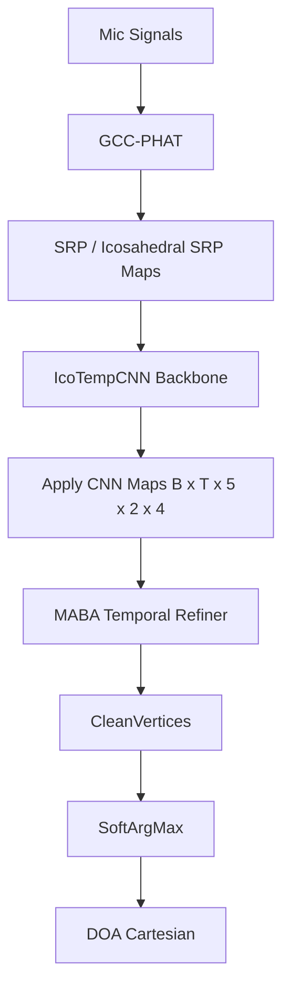
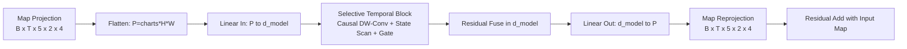

# MABA-DOA: 插入式时序增强设计（IcoTempCNN 后接轻量 MABA）

## 1. 问题定义

当前 `IcoTempCNN` 的输出链路是：

`SRP/IcoMap -> apply_cnn() -> clean_vertices -> SoftArgMax -> DOA`

在这一链路中，`apply_cnn()` 已经得到逐帧球面响应图，但 `SoftArgMax` 直接对单帧响应图做归一化加权回归。  
当场景存在噪声、混响或短时峰值扰动时，容易出现：

1. 响应图主峰抖动；
2. 伪峰短时增强；
3. 帧间轨迹不连续，导致 DOA 序列抖动。

因此提出在 `apply_cnn()` 后、`SoftArgMax` 前增加轻量时序增强模块（MABA），以提升轨迹稳定性，同时保持硬件可映射性。

---

## 2. 插入式 MABA 架构

核心思想：不改 SRP 前端和 IcoTempCNN 主干，仅在响应图回归头前插入一个低复杂度时序增强头。

新增链路：

`SRP/IcoMap -> IcoTempCNN.apply_cnn() -> MABA -> clean_vertices -> SoftArgMax -> DOA`

设计原则：

1. 插入式：对原模型侵入最小，便于对照实验；
2. 轻量化：使用线性时序扫描 + 局部因果卷积；
3. 可解释：输出仍是响应图，便于做前后可视化；
4. 硬件友好：避免 `O(T^2)` 全局注意力矩阵。

### 2.1 系统级链路图

### 2.2 模块级数据流图

---

## 3. 数学定义

给定 `apply_cnn()` 输出：

`X in R^(B x T x C x H x W)`，其中 `C=5`（charts），`H=2`，`W=4`（r=2 常用设置）。

令 `P = C * H * W`，展平后为：

`Xf in R^(B x T x P)`

### 3.1 投影与局部时序混合

1. 线性投影：`U = Xf * W_in + b_in`，`U in R^(B x T x D)`
2. 因果深度卷积：`V = DWConv_causal(U)`
3. 归一化与残差：`Z = LN(U + V)`

### 3.2 选择性状态更新（轻量 SSM 风格）

令状态维度为 `S`。定义：

`[Q_t, G_t] = Z_t * W_state + b_state`

`alpha_t = sigmoid(G_t)`（若关闭门控则使用常量 `alpha`）

`h_t = alpha_t odot h_(t-1) + (1 - alpha_t) odot Q_t`

其中 `h_t in R^S`，`odot` 是逐元素乘法。

### 3.3 输出重建

`R_t = h_t * W_back + b_back`，`R_t in R^D`

`Yf_t = (Z_t + R_t) * W_out + b_out`，`Yf_t in R^P`

重排得到 `Y in R^(B x T x C x H x W)`。

若使用输出残差：

`Y_hat = X + Y`

最终输入 `SoftArgMax` 的图为 `Y_hat`（再经过 `clean_vertices`）。

---

## 4. 复杂度分析与硬件友好性

### 4.1 MABA 复杂度（线性时序）

设投影维度 `D`、状态维度 `S`、卷积核 `K`。

每帧主要开销近似：

1. `P -> D` 投影：`O(PD)`
2. 深度卷积：`O(DK)`
3. 状态更新与门控：`O(DS + S)`
4. `D -> P` 回投影：`O(DP)`

总复杂度约：

`O(T * (2PD + DK + DS + S))`

是随 `T` 线性增长。

### 4.2 与 `T^2` 注意力对比

全局时序注意力通常需要显式 `T x T` 相关矩阵，复杂度接近 `O(T^2 * D)`。  
MABA 采用扫描更新，不构建全局注意力矩阵，避免了 `T^2` 级存储与访存压力。

### 4.3 硬件友好性

1. 主要算子是 `Linear / DW-Conv / Elementwise`，HLS 友好；
2. 状态更新为单向扫描，控制逻辑简单；
3. 不需要全局 attention buffer，片上存储压力更可控；
4. 可按 `T` 分段流式处理，便于后续 pipeline 化。

---

## 5. 与基线对比

### 5.1 架构差异

1. Baseline：`apply_cnn -> clean_vertices -> SoftArgMax`
2. MABA 方案：`apply_cnn -> MABA -> clean_vertices -> SoftArgMax`

### 5.2 预期收益

1. 帧间 DOA 抖动下降；
2. 多峰噪声场景下主峰鲁棒性提升；
3. 对 `SoftArgMax` 输入图更“尖锐且连续”。

### 5.3 代价

1. 新增一段时序增强计算；
2. 参数量小幅上升；
3. 需要额外做消融以证明收益来源。

---

## 6. 论文创新点凝练

### 6.1 结构创新

提出面向球面 DOA 回归头的插入式时序增强结构：在不改 SRP 前端与 IcoTempCNN 主干的前提下，引入 `Map-level` 时序精炼模块。

### 6.2 方法创新

提出轻量选择性状态更新机制用于响应图时序增强：通过门控状态扫描替代全局时序注意力，实现线性复杂度的时序一致性建模。

### 6.3 工程创新

提出“论文可解释 + 工程可落地 + 硬件可映射”的统一设计：模块输出仍为响应图，便于可视化分析，同时算子集合可直接映射到 FPGA 友好计算原语。

---

## 7. 实验方案

### 7.1 对照组

1. `Baseline`: 原 `IcoTempCNN`
2. `+MABA`: `apply_cnn` 后插入轻量 MABA
3. `Ablation-1`: 去掉门控（`use_gate=False`）
4. `Ablation-2`: 去掉状态更新（`use_state=False`）

### 7.2 指标

1. 主指标：`RMSAE`
2. 代价指标：参数量、MAC proxy、单步推理时延（CPU/GPU）
3. 稳定性指标：帧间角度抖动统计（轨迹平滑度）

### 7.3 可视化

1. `MABA` 前后响应图热力图对比；
2. 同一轨迹的 DOA 曲线对比；
3. 误差分布（箱线图或 CDF）对比。

### 7.4 统计口径

1. 固定随机种子；
2. 在多个 `T60/SNR` 条件下重复评估；
3. 报告均值与标准差，并给出显著性检验结论（若样本量允许）。

---

## 附：实现参数建议（第一版）

1. `maba_d_model = 64`
2. `maba_state_dim = 16`
3. `maba_conv_kernel = 3`
4. `dropout = 0.1`
5. `use_residual = True`

该参数组用于第一版可复现实验，后续可通过网格搜索进一步优化。
